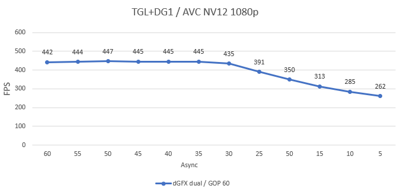
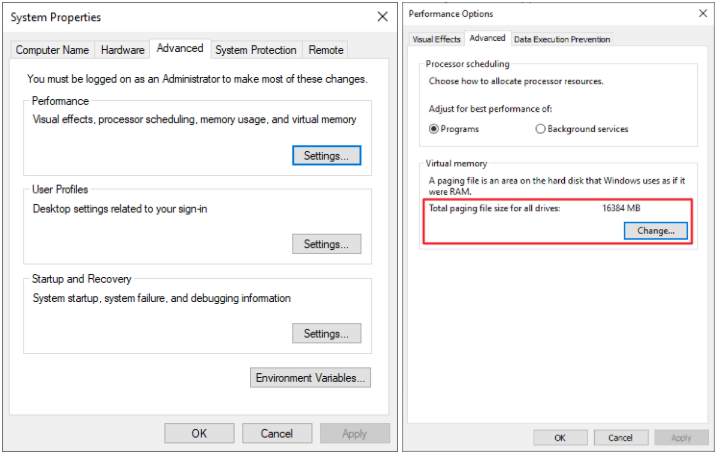

# **Intel® oneVPL Deep Link Hyper Encode Feature Developer Guide**

<div style="page-break-before:always" />

**LEGAL DISCLAIMER**

INFORMATION IN THIS DOCUMENT IS PROVIDED IN CONNECTION WITH INTEL PRODUCTS. NO LICENSE, EXPRESS OR IMPLIED, BY ESTOPPEL OR OTHERWISE, TO ANY INTELLECTUAL PROPERTY RIGHTS IS GRANTED BY THIS DOCUMENT.  EXCEPT AS PROVIDED IN INTEL'S TERMS AND CONDITIONS OF SALE FOR SUCH PRODUCTS, INTEL ASSUMES NO LIABILITY WHATSOEVER AND INTEL DISCLAIMS ANY EXPRESS OR IMPLIED WARRANTY, RELATING TO SALE AND/OR USE OF INTEL PRODUCTS INCLUDING LIABILITY OR WARRANTIES RELATING TO FITNESS FOR A PARTICULAR PURPOSE, MERCHANTABILITY, OR INFRINGEMENT OF ANY PATENT, COPYRIGHT OR OTHER INTELLECTUAL PROPERTY RIGHT.

UNLESS OTHERWISE AGREED IN WRITING BY INTEL, THE INTEL PRODUCTS ARE NOT DESIGNED NOR INTENDED FOR ANY APPLICATION IN WHICH THE FAILURE OF THE INTEL PRODUCT COULD CREATE A SITUATION WHERE PERSONAL INJURY OR DEATH MAY OCCUR.

Intel may make changes to specifications and product descriptions at any time, without notice. Designers must not rely on the absence or characteristics of any features or instructions marked "reserved" or "undefined." Intel reserves these for future definition and shall have no responsibility whatsoever for conflicts or incompatibilities arising from future changes to them. The information here is subject to change without notice. Do not finalize a design with this information. 

The products described in this document may contain design defects or errors known as errata which may cause the product to deviate from published specifications. Current characterized errata are available on request. 

Contact your local Intel sales office or your distributor to obtain the latest specifications and before placing your product order. 

Copies of documents which have an order number and are referenced in this document, or other Intel literature, may be obtained by calling 1-800-548-4725, or by visiting [Intel's Web Site](http://www.intel.com/).

MPEG is an international standard for video compression/decompression promoted by ISO. Implementations of MPEG CODECs, or MPEG enabled platforms may require licenses from various entities, including Intel Corporation.

Intel and the Intel logo are trademarks or registered trademarks of Intel Corporation or its subsidiaries in the United States and other countries.

\*Other names and brands may be claimed as the property of others.

Copyright © 2020-2021, Intel Corporation. All Rights reserved.
<div style="page-break-before:always" /> 

- [Overview](#overview)
- [Developer guide](#developer-guide)
  * [Feature API](#feature-api)
  * [Migrating your application from Intel Media SDK to Intel oneVPL](#migrating-your-application-from-intel-media-sdk-to-intel-onevpl)
  * [Running application with oneVPL runtime](#running-application-with-onevpl-runtime)
  * [How to get the best performance](#how-to-get-the-best-performance)
  * [Choice of async value](#choice-of-async-value)
  * [How to prepare the system](#how-to-prepare-the-system)
- [Release Notes](#release-notes)
  * [Supported configurations](#supported-configurations)
  * [Known limitations](#known-limitations)

# Overview

Intel(R) oneVPL Deep Link Hyper Encode Feature leverages Intel integrated and discrete graphics on one system to accelerate encoding of a single video stream. The feature is exposed through Intel oneVPL [API](https://spec.oneapi.com/versions/latest/elements/oneVPL/source/index.html) and implemented in oneVPL GPU runtimes delivered with Intel graphics drivers.

For the sake of readability, we will refer to the following Intel processor families by their former codenames:

-   Intel Xe discrete graphics will be referred to as "DG1"
-   11th Generation Intel® Core™ Processors will be referred to as "TGL" (Tiger Lake)

# Developer guide

## Feature API

-   The feature is enabled and configured through `mfxExtHyperModeParam mfxExtBuffer` interface:
```c++
/*! The mfxHyperMode enumerator describes HyperMode implementation behavior. */
typedef enum {
    MFX_HYPERMODE_OFF = 0x0,        /*!< Don't use HyperMode implementation. */
    MFX_HYPERMODE_ON = 0x1,         /*!< Enable HyperMode implementation and return error if some issue on initialization. */
    MFX_HYPERMODE_ADAPTIVE = 0x2,   /*!< Enable HyperMode implementation and switch to single fallback if some issue on initialization. */
} mfxHyperMode;

/*! The structure is used for HyperMode initialization. */
typedef struct {
    mfxExtBuffer    Header;         /*!< Extension buffer header. BufferId must be equal to MFX_EXTBUFF_HYPER_MODE_PARAM. */
    mfxHyperMode    Mode;           /*!< HyperMode implementation behavior. */
    mfxU16          reserved[19];
} mfxExtHyperModeParam;
```
-   Application must attach `mfxExtHyperModeParam` structure to the list of extension buffers for encoder’s `mfxVideoParam`:
```c++
mfxVideoParam par;
par.NumExtParam = 1;
par.ExtParam = new mfxExtBuffer * [par.NumExtParam];

auto hyperModeParam = new mfxExtHyperModeParam;
hyperModeParam->Mode = MFX_HYPERMODE_ON;

par.ExtParam[0]->BufferId = MFX_EXTBUFF_HYPER_MODE_PARAM;
par.ExtParam[0] = &hyperEncodeParam->Header;
```

## Migrating your application from Intel Media SDK to Intel oneVPL

1.  Rebuild your application with new oneVPL headers and link application with oneVPL dispatcher from the package.
2.  Change MFX session initialization in the following way (check sample_encode source for reference):

From
```c++
mfxSession session;
mfxIMPL impl = MFX_IMPL_HARDWARE;
mfxVersion version = { {1,1} };
MFXInit(impl, &version, &session);
```

To    
```c++
mfxLoader loader = MFXLoad();
mfxConfig cfg = MFXCreateConfig(loader);
mfxVariant ImplValue;
ImplValue.Type = MFX_VARIANT_TYPE_U32;
ImplValue.Data.U32 = MFX_IMPL_TYPE_HARDWARE;
MFXSetConfigFilterProperty(cfg,"mfxImplDescription.Impl",ImplValue);
MFXCreateSession(loader,0,&session);
```

3.  For more information please refer to full migration guide [here](https://software.intel.com/content/www/us/en/develop/articles/upgrading-from-msdk-to-onevpl.html)

## Running application with oneVPL runtime

1.  Download and install the [graphics driver](https://downloadcenter.intel.com/), containing oneVPL runtime.
2.  Download and install the [Toolkit](https://software.intel.com/content/www/us/en/develop/tools/oneapi/components/onevpl.html), containing sampe_encode and oneVPL dispatcher.
3.  Find `sample_encode.exe` application in the installation folder.
4.  Run simple example of sample_encode command line with enabled Deep Link Hyper Encode feature:
```bash
sample_encode h264 -i input.yuv -o output.h264 -dGfx -dual_gfx::on -w 1920 -h 1080 -nv12 -idr_interval 0 -d3d11 -async 30 -g 30 -r 1 -u 4 -lowpower:on -perf_opt 10 -n 2000 -api2x_dispatcher        
```
5.  Sample_encode source code please find [here](https://github.com/oneapi-src/oneVPL/commits/master).

## How to get the best performance

sample_encode tool has performance mode. This mode enables by using `-perf_opt n` option. It sets `n` prefetched frames (application preallocates buffers and preload `n` first frames to buffers from input stream). Performance mode allows to evaluate clear benefit of the Deep Link Hyper Encode feature, excluding input stream reading from measurements and providing permanent load of Deep Link Hyper Encode with input surfaces. And this is the main requirement for the applications, otherwise Deep Link Hyper Encode will not bring performance improvement if it will not be loaded enough with new surfaces.

## Choice of async value

Figure 1 shows performance dependency from the async value. For example, for AVC NV12 4K GOP=60 – common async value threshold is 35. It means, that for async>=35 there are no performance lost and at the same time lower async value helps to reduce memory consumption. For async<35 performance fall lower than 424 fps.

But please pay attention, that these data depend on the system configuration (especially physical memory size) and application, in which LE library would be integrated. So, this chart cannot be universal recommendation for optimal async value selection. The chart is for informational purposes only to show possibility of using async value lower than GOP size without performance lost.

###### Figure 1: Chart Of Async Values


## How to prepare the system

HW/SW requirements:

1.  iGPU: TGL
2.  dGPU: DG1

Set virtual memory not less than physical memory size as illustrated in Figure 2.

###### Figure 2: System Settings


# Release Notes

## Supported configurations

-   Deep Link Hyper Encode was tested on TGL+DG1.
-   Supports AVC and HEVC encoders in low power mode (VDENC); Direct3D11 and system memory surfaces in NV12/P010/RGB format; VBR/CQP/ICQ bitrate control modes.

## Known limitations

-   If encoder configured with MFX_HYPERMODE_ADAPTIVE it will automatically fall back to single GPU when underlying parameter combination is not supported for hyper encoding.
-   For achieving good performance, we recommend using async value not less than GOP size, but this might be not possible to achieve due to memory volume limitation, then we recommend tuning down async.
-   Performance on AVC 4K NV12 dx11 for DG1 as primary graphics is lower than expected.
-   Performance on HEVC 4K P010 dx11 for DG1 as primary graphics is lower than expected.
